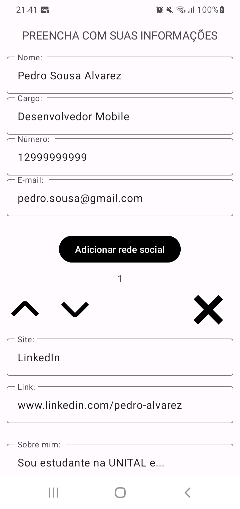
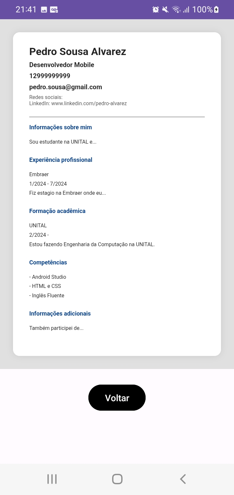
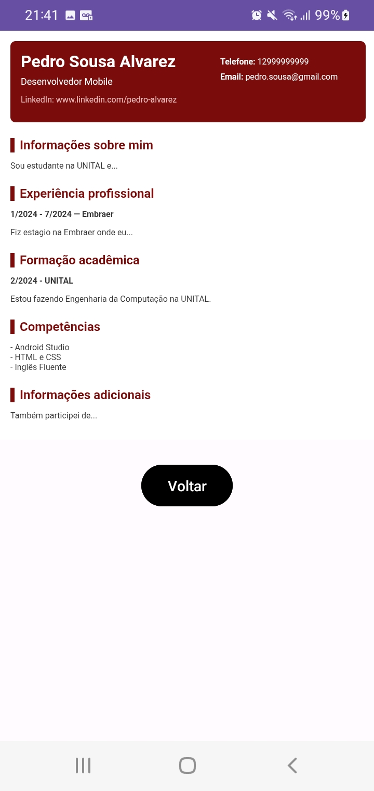

# Meu Currículo Dinâmico

Meu Currículo Dinâmico é um aplicativo Android para fácil criação de currículos, disponibilizando diferentes modelos para serem salvos.

Ele foi desenvolvido usando Android Studio, usando HTML para os modelos de currículo.

  

**Aplicativo feito por Paulo Vilalta e Pedro Henrique Santos.**
